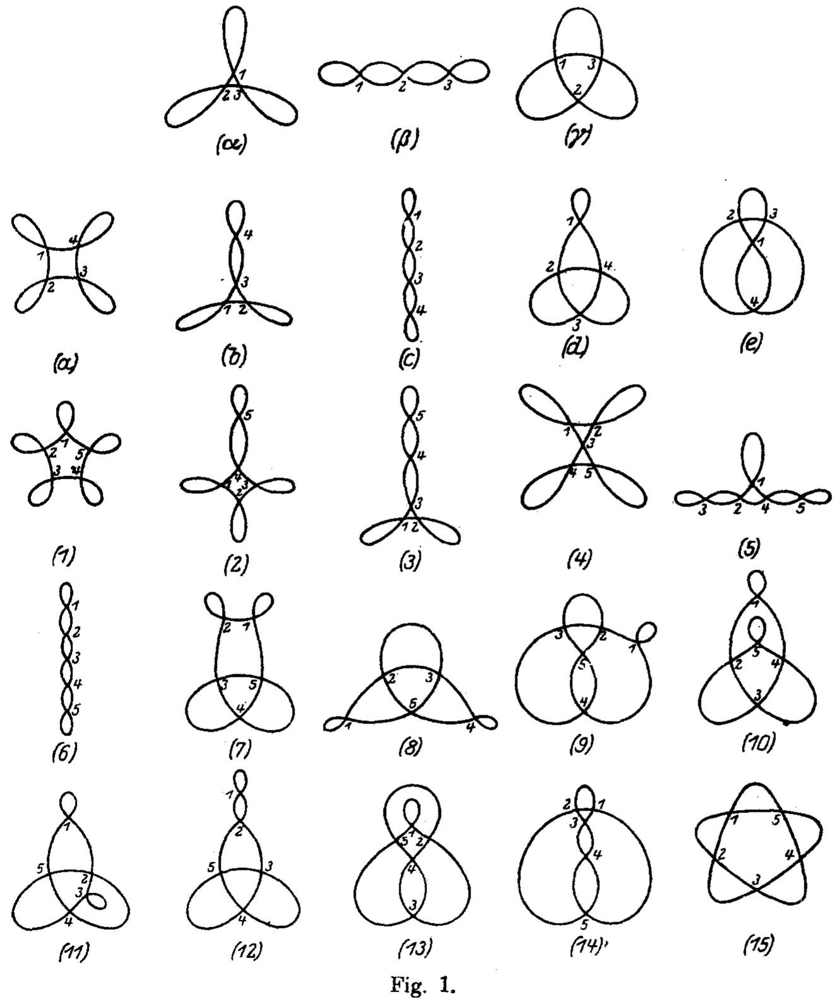
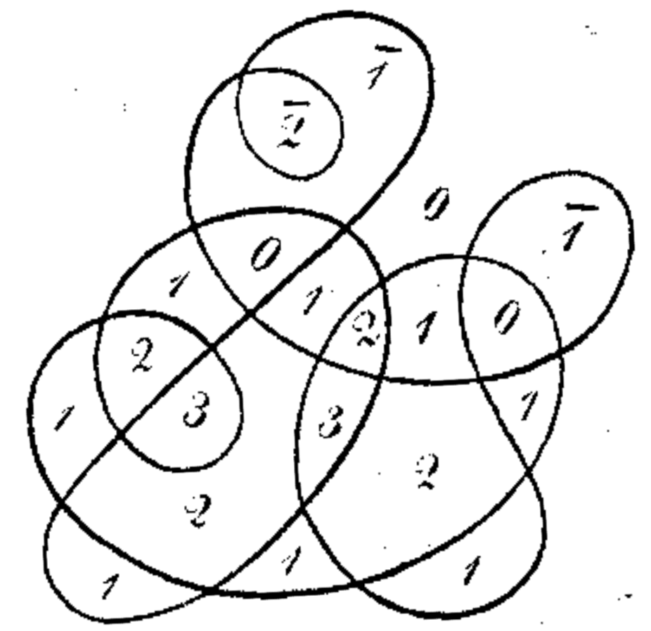
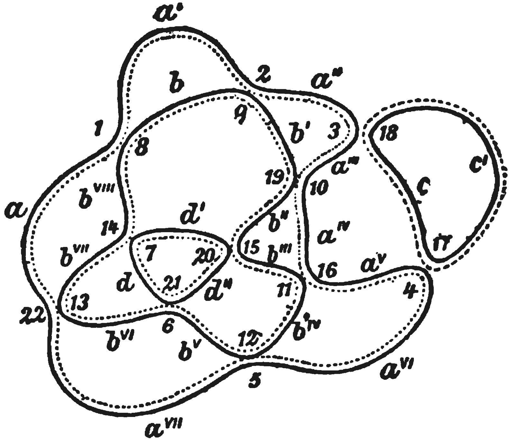
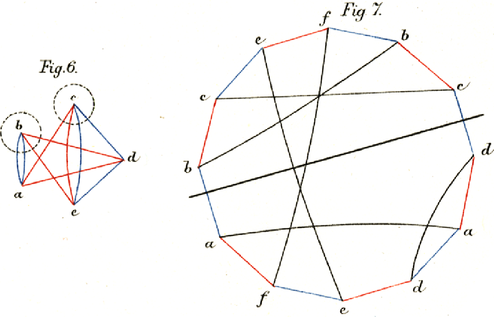
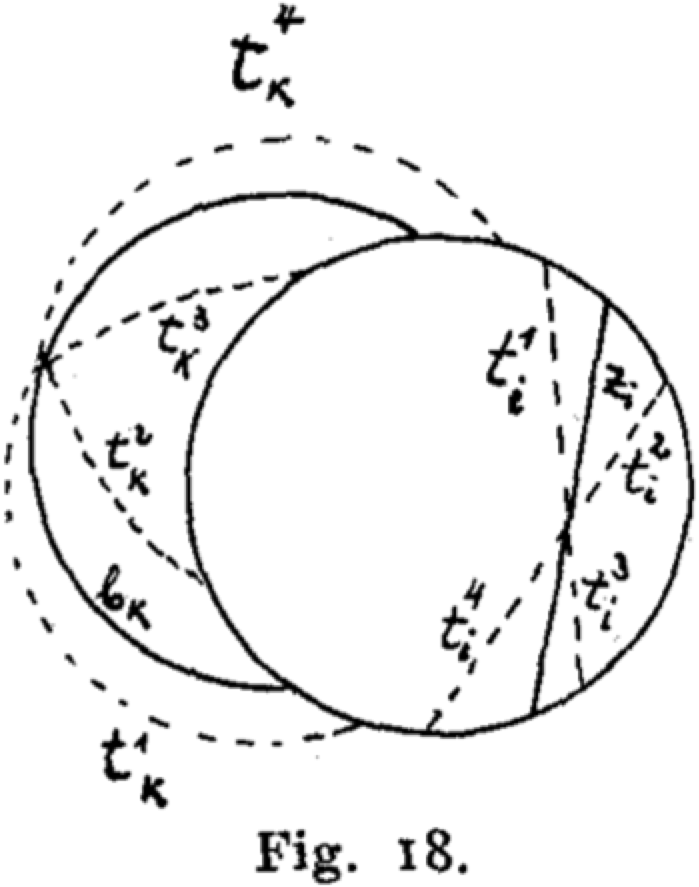

# Unsigned Gauss codes$^\beta$

In the last lecture, we saw a simple algorithm to test whether a signed Gauss code is consistent with a generic curve in the plane: Count the faces (by symbol-chasing) and return true if and only if the number of faces is exactly two more than the number of crossings.

In his unpublished notes, written around 1840, Gauss was asked how to determine whether an _unsigned_ Gauss code is consistent with a planar curve [3].  The same question was published about 40 years later by Tait [8]. I regard this as the first problem in computational topology.  (Euler’s famous Bridges of Königsberg is the _zeroth_ problem in computational topology.)  B oht Gauss and Tait described a _partial_ solution to his problem.  The first complete solution was proposed by Julius Nagy almost a century later [4].[^nagy]

[^nagy]: Nagy’s algorithm attempts to construct a _Seifert decomposition_ of the encoded curve.  I’m afraid I don’t understand Nagy’s solution well enough to describe it, or even to be confident that it is correct. 

{ width=60% }

In this lecture, I’ll describe an $O(n^2)$-time _algorithm_ originally described by Max Dehn in 1936 [1], with some simplifications suggested by Nagy’s solution and more modern graph algorithms, as suggested by Read and Rosenstiehl [11], Rosenstiehl and Tarjan [12], and de Fraysseix and Ossona de Mendez [3].[^moar]  My presentation of Dehn’s algorithm also closely follows Kaufmann. ***[[Fix reference numbers]]***

[^moar]: ***Dozens*** of other combinatorial and algebraic characterizations of planar Gauss codes have been published since Dehn’s solution, but as far as I know, none lead to a simpler or more efficient algorithm (except through the use of linear-time algorithms to test graph planarity, which is cheating).

## Winding numbers again

Recall that the winding number of a polygon $P$ around a point $o$ can be computed by shooting a vertical ray from $o$ and counting positive and negative crossings with the polygon.  The same characterization extends to generic curves, but it’s a little unsatisfying, for a couple of reasons.  First, we only care about curves _up to isotopy_, but the ray-shooting algorithm requires choosing a specific (arbitrary) curve in the isotopy class.  We can soften this objection somewhat by observing that we don’t really need to count crossings with a _ray_;  any path from $o$ to infinity that crosses the curve a finite number of times will work.

But there’s a more serious objection.  Our representation of closed curves (signed Gauss codes) doesn’t include any geometric information.  But how do we represent the point?  We can’t give _coordinates_, because different curves with the same representation have different winding numbers around any _fixed_ point!

Instead, we specify the obstacle point $o$ by declaring which _face_ of the curve contains it.  More cleanly, we define the winding number of a curve $\gamma$ around each of its _faces_ using an _Alexander numbering_,  we defined in Lecture 2 for polygons.  For any directed edge $e$ of the image graph, let $\textsf{left}(e)$ and $\textsf{right}(e)$ denote the faces immediately to the left and right of $e$ (relative to the orientation of $e$).

* If $f$ is the outer face, then $\textsf{wind}(\gamma, f) = 0$.
* For every directed edge $e$, we have $\textsf{wind}(\textsf{left}(e)) = \textsf{wind}(\textsf{right}(e)) + 1$

{ width=30% }

## Smoothing

Gauss observed that we can also define winding numbers by _smoothing_ the curve at each vertex.  Smoothing replaces a neighborhood of a single vertex with a pair of disjoint curve segments.  In fact there are two different smoothing operations, depending on how the disjoint curve segments are attached.  One smoothing operation disconnects the curve (or connects two constituents of a multicurve) but preserves the direction of both subcurves.  The other keeps the curve connected, but requires the direction of part of the curve to be reversed.

{ width=95% }

Gauss observed that by smoothing _every_ vertex of a curve to preserve direction, we can decompose the curve into a finite set of disjoint _simple_ curves.  This collection of simple curves is called the _Seifert_ decomposition of the curve.  Each of these simple curves has winding number $+1$ or $-1$ around its interior, depending whether the curve is oriented counterclockwise or clockwise.

The winding number of a curve $\gamma$ around any point $o$ (far from the vertices) is equal to the sum of the winding numbers of the curves  in the Seifert decomposition of $\gamma$ around $o$.  Equivalently, $\textsf{wind}(\gamma, 0)$ is equal to the number of counterclockwise cycles that contain $o$ minus the number of clockwise cycles that contain $o$.

{ width=35% }

## Gauss’s parity condition

Gauss observed without proof that the unsigned Gauss code of every planar curve satisfies a simple parity condition:  Every substring that starts and ends with the same symbol has even length, or equivalently, each symbol appears once at an even index and once at an odd index. This parity condition was first proved necessary by Nagy.  The following simpler combinatorial proof is due to Rademacher and Toeplitz.

**Lemma:**
: _Every pair of generic closed curves that intersect only transversely intersect at an even number of points._

**Proof:**
: Let $\alpha$ and $\beta$ be a transverse pair of generic closed curves, directed arbitrarily. Imagine a point moving around $\alpha$.  Each time this point crosses $\beta$, the winding number of $\beta$ around that point changes by $1$, and therefore changes from even to odd or vice versa. The moving point starts and ends in the same face of $\beta$, so its winding number change parity an even number of times.

Now let $X$ be a string of length 2n, in which each of the $n$ unique symbols appears twice.

**Lemma:**
: _If $X$ is the Gauss code of a planar curve, then every substring of $X$ that starts and ends with the same symbol has even length._

**Proof:**
: Let $\gamma$ be a planar closed curve.  Smoothing $\gamma$ at any vertex produces two subcurves $\alpha$ and $\beta$.  Up to a cyclic shift (reflecting a change of basepoint), the Gauss code for $\gamma$ can be written as $axay$, where $a$ is the label of the vertex, substring $x$ encodes the crossings along $\alpha$, and string $y$ encodes the crossings along $\beta$. Each self-intersection point of $\alpha$ is encoded in $x$ twice, and the other symbols of $x$ encode the intersections between $\alpha$ and $\beta$  We conclude that $x$ has even length, which completes the proof.

We can test this parity condition in $O(n^2)$ time by brute force, but in fact, there is a simple linear-time algorithm.  Given the Gauss code $X$, we can define a directed graph $G(X)$, which I’ll call the _Nagy graph_ of $X$, as follows:

* The vertices of $G(X)$ correspond to the $n$ distinct symbols in $X$.
* The edges of $G(x)$ correspond to (cyclic) substrings of $X$ with length $2$, alternately directed forward and backward.  That is, the Nagy graph contains a forward edge $x_i\to x_{i+1}$ for every even index $i$ and a backward edge and $x_{i+1}\to x_i$ for every odd index $i$.  For example, the Nagy graph of the string `abcdefgchaigdjkhbifejk` contains the following edges:
$$
	a\mathord\rightarrow b\mathord\leftarrow
	c\mathord\rightarrow d\mathord\leftarrow
	e\mathord\rightarrow f\mathord\leftarrow
	g\mathord\rightarrow c\mathord\leftarrow
	h\mathord\rightarrow a\mathord\leftarrow
	i\mathord\rightarrow g\mathord\leftarrow
	d\mathord\rightarrow j\mathord\leftarrow
	k\mathord\rightarrow h\mathord\leftarrow
	b\mathord\rightarrow i\mathord\leftarrow
	f\mathord\rightarrow e\mathord\leftarrow
	j\mathord\rightarrow k\mathord\leftarrow a
$$

Let me emphasize (despite the figure below) that the Nagy graph of a string is an _abstract graph_, which may or may not be planar.

{ width=35% }

Now imagine a point moving around the Nagy graph $G(X)$, alternately traversing edges forward and backward in the order they appear in $X$.  Whenever the point passes through a vertex of $G(X)$, it either traverses two inward edges $u\mathord\rightarrow v\mathord\leftarrow w$ (one forward and one backward) or two outward edges $u\mathord\leftarrow v\mathord\rightarrow w$ (one backward and one forward).  The parity condition implies that if we leave any vertex $v$ along a forward edge $v\mathord\to w$, we will next enter $v$ along a backward edge $x\mathord\leftarrow v$ and v vice versa.  In fact, these two conditions are equivalent.

**Lemma:**
: _A Gauss code $X$ satisfies the parity condition if and only if every vertex of its Nagy graph $G(X)$ has in-degree 2 and out-degree $2$._

If a Gauss code does _not_ satisfy the parity condition, then its Nagy graph will contain at least one vertex with in-degree 0 and out-degree 4, and an equal number of vertices with in-degree $4$ and out-degree $0$.

We can easily construct the Nagy graph and check the degree of each vertex in $O(n)$ time, where $X$ is the length of the given Gauss code.  (There are simpler algorithms to check the parity condition in $O(n)$ time, but we’ll need the Nagy graph later, so we might as well build it now.)

Gauss also observed that the sequences `abcadcedbe` and `abcabdecde` satisfy his parity condition but cannot be realized by planar curves, so the parity condition is not sufficient. Tait later gave a third example `abcadebdec`.

## Dehn’s non-crossing condition

About 100 years after Gauss, Dehn [1] described _das Gaussische Problem der Trakte_ and proposed an algorithm to solve it.  Dehn observed that smoothing every vertex of a curve _to keep the curve connected_ results in a simple closed curve that _touches_ itself at every vertex.  The same closed curve $\gamma$ can have several different connected smoothings.

{ width=35% }

**Lemma:**
: _Every connected smoothing of a planar curve $\gamma$ is an Euler tour of the Nagy graph $G(X(\gamma))$, and vice versa._

**Proof:**
: Consider two consecutive edges $u\mathord\to v\mathord\to w$ of $\gamma$ (_not_ edges of $G(X(\gamma))$).  Imagine smoothing the vertices of $\gamma$ one at a time.  Each smoothing reverses one of the subcurves from the smoothed vertex to itself.  The edges $uv$ and $vw$ are reversed by all these same smoothing _except_ at their common vertex $x$.  Thus, exactly one of the two subpaths $u\mathord\to v$ or $v\mathord\to w$ is revised in the final Dehn smoothing.  It follows that every Dehn smoothing of $\gamma$ is an Euler tour of $G(X(\gamma))$.

: On the other hand, the edges incident to any vertex of $G(X(\gamma))$ alternative in, out, in, out in cyclic order.  Thus, every Euler tour of $G(X(\gamma))$ touches itself at every vertex, but never crosses itself.  It follows that every Euler tour of $G(X(\gamma))$ is a connected smoothing of $\gamma$.

**Lemma:**
: _A Gauss code $X$ is realized by a planar curve if and only if its Nagy graph $G(X)$ has a planar embedding in which at least one (and therefore every) Euler tour is weakly simple._

**Proof:**
: An Euler tour of a planar graph can cross itself only at vertices.  If $X$ is the Gauss code of a planar curve $\gamma$, the edges incident to any vertex of $G(X)$, embedded on top of $\gamma$ in the obvious way, alternate in-out-in-out in cyclic order, which makes a crossing at that vertex impossible.

: On the other hand, suppose $G(X)$ has a planar embedding with a weakly simple Euler tour.  Then the edges incident to each vertex in that embedding must alternate in-out-in-out in cyclic order.  The original Gauss code $X$ defines an _undirected_ Euler tour $U$ of $G(X)$, which traverses edges of $G(X)$ alternately forward and backward.  $U$ crosses itself at every vertex of $G(X)$.  It follows immediately that $U$ is a closed curve with Gauss code $X$.

## Tree-onion figures

Dehn described a symbolic algorithm to test his non-crossing condition in terms of the sequence of _self-touching_ points in order along the smoothed curve $\tilde\gamma$.  Just like Gauss codes, this sequence contains exactly two occurrences of every symbol.  To distinguish this sequence from the Gauss code of a curve, I’ll refer to this new string as a _Dehn code_.  We can similarly define the _Dehn diagram_ of $\tilde\gamma$ as a cycle of $2n$ vertices, corresponding to the labels in the Dehn code, plus chords connecting identical labels.[^dehn]

[^dehn]: The terms “Dehn code” and “Dehn diagram” are nonstandard.

Dehn observed that the Dehn diagram of any connected smoothing $\tilde\gamma$ of any planar curve $\gamma$ is a _planar_ graph; that is, we can embed some of the chords of the diagram inside the circle and the rest outside the circle, so that no pair of chords intersects.  Specifically, if we perturb $\tilde\gamma$ slightly into a simple curve, the neighborhood of each vertex either has connected intersection with the interior of $\tilde\gamma$ or connected intersection with the exterior of $\tilde\gamma$.  These vertices correspond to inner and outer chords, respectively.

{ width=40% }

Dehn playfully referred to these planar diagrams as “Baum-Zwiebel Figuren” [“tree-onion diagrams”] and their corresponding Gauss codes as “Baum-Zwiebel Reihen” [“tree-onion strings”].
Tree onions, also known as walking onions or Egyptian onions, are onion cultivars that grow clusters of small bulbs at the top of the stem, where other _Allium_ species have flowers.  The chords of a tree-onion figure (loosely) resemble clusters of onion layers.  Coincidentally(?), the dual graph of the inner chords (or the outer chords) of any tree-onion figure is a tree.[^bz]

[^bz]: Tree-onion figures are also closely related to tree-cotree decompositions of planar maps.  Specifically, there is a bijection between tree-cotree decompositions of a planar map $\Sigma$  and tree-onion figures of non-crossing Euler tours of the medial map $\Sigma^\times$.  (Don’t worry; those words will make sense soon.)  So it’s really tempting to refer to the partition of inner and outer chords in a tree-onion figure as a _coonion-onion decomposition_.

![A tree-onion figure [Dehn 1936]](Fig/Dehn-BZ-Figur){ width=30% }

, via [Wikimedia Commons](https://commons.wikimedia.org/wiki/File:Allium_fistulosum_bulbifera0.jpg)]](Fig/tree-onion-photo.jpg){ width=40% }

{ width=40% }

(Petersen [9] used similar diagrams in 1891 to study abstract regular graphs.  Consider a connected $4$-regular graph $G$ with $n$ vertices.  Petersen defined a “stretched graph” by representing any Euler tour of $G$ as a cycle of length $2n$, with additional edges connecting the two occurrence of each vertex of $G$.  If we alternately color the edges this cycle red and blue, every vertex of $G$ is incident to two edges of each color.  Thus, every $4$-regular graph can be decomposed into two 2-factors.  Applying Petersen’s construction to any curve, as an Euler tour of its image graph, recovers the forward and backward cycles in the curve’s Nagy graph.)

{ width=50% }

## Bipartite interlacement

Read and Rosenstiehl [6] observed that Dehn’s planarity condition can verified efficiently by constructing yet another graph, called the _interlacement graph_ of the Dehn code.  The interlacement graph has $n$ vertices, one for each symbol, and an edge between any two symbols $x$ and $y$ whose appearances are interlaced $x\dots y \dots x\dots y$ in the Dehn code.  Partitioning the chords of a Dehn diagram into pairwise disjoint inner and outer chords is equivalent to partitioning the vertices of the interlacement graph into two independent sets.  In other words, a Dehn diagram is planar if and only if its interlacement graph is bipartite.

{ width=40% }

## Recrossing

To complete his algorithm, Dehn observed that we can transform the Dehn diagram of any Euler tour of $G(X)$ into a 4-regular graph by replacing each chord with a pair of crossing chords with a crossing, as shown below.  Assuming the interlacement graph of the Dehn code is bipartite, the corresponding Dehn diagram is planar, so this recrossing process yields a single closed curve consistent with our original Gauss code $X$.

{ width=25% }

{ width=65% }

Putting all the pieces together, we conclude: 

**Theorem:**
: _A Gauss code $X$ can be realized by a planar closed curve if and only if at least one (and therefore every) Euler tour of $G(X)$ has a bipartite interlacement graph._

## Algorithm summary

**Theorem:**
: _Given a Gauss code $X$ of length $2n$, we can either construct a planar curve consistent with $X$ or correctly report that no such curve exists, in $O(n^2)$ time._

**Proof:**
: The algorithm proceeds as follows:

: 1. Construct the Nagy graph $G(X)$ of $X$.  This can be done in $O(n)$ time by brute force.  If any vertex of $G(X)$ has no outgoing edges, halt and report that $X$ is not realizable.   Otherwise, $G(X)$ is Eulerian, and thus $X$ satisfies Gauss’s parity condition.

: 2. Compute any Euler tour of $G(X)$.  This can be done in $O(n)$ time using the well-known algorithm of Hierholzer (not Euler!).

: 3. Construct the Dehn code $\tilde{X}$ of this Euler tour.  This can be done in $O(n)$ time by brute force.

: 4. Construct the interlacement graph $I(\tilde{X})$ of $\tilde{X}$.  This can be done in $O(n^2)$ time by brute force.

: 5. Verify that the interlacement graph is bipartite.  The interlacement graph has $n$ vertices and at most $O(n^2)$ edges, so we can verify bipartiteness in $O(n^2)$ time uysing whatever-first search.  If the interlacement graph is not bipartite, halt and report that $X$ is not realizable.

: 6. Build a tree-onion figure for $\tilde{X}$ from any partition of nodes in the interlacement graph.  This can be done in $O(n)$ time by brute force.

: 7. Transform the plane Dehn diagram into a 4-regular plane graph by replacing each chord with a pair of crossing chords, as shown in Figures 13 and 14.  This can be done in $O(n)$ time by brute force; the result is a closed curve consistent with our original Gauss code $X$.

{ width=100% }

## Faster! Faster!

There are several linear-time algorithms to test the interlacement condition _without_ explicitly constructing the interlacement graph, but we’re out of time.

## $\dots$and the Aptly Named Yadda Yadda

* Tait-Dowker-Thistlethwaite codes
* Pile of twin stacks algorithm
* Left-right graph planarity test 

## References

1. Max Dehn. [Über kombinatorishe Topologie](https://doi.org/10.1007/BF02401740). _Acta Math._ 67:123–168, 1936.

1. Clifford H. Dowker and Morwen B. Thistlethwaite. [Classification of knot projections](https://doi.org/10.1016/0166-8641(83)90004-4). _Topology Appl._ 16(1):19–31, 1983.

1. Hubert de Fraysseix and Patrice Ossona de Mendez.  [A short proof of a Gauss problem](https://doi.org/10.1007/3-540-63938-1_65).  _Proc. 5th Int. Symp. Graph Drawing_, 230–235, 1997. Lecture Notes Comput. Sci. 1353, Springer.

1. Carl Friedrich Gauß. Nachlass. I. Zur Geometria situs. _Werke_, vol. 8, 271–281, 1900. Teubner.  Originally written between 1823 and 1840.

1. Carl Hierholzer. [Über die Möglichkeit, einen Linienzug Ohne Wiederholung und ohne Unterbrech nung zu umfahren.](https://doi.org/10.1007/BF01442866)  _Math. Ann._ 6:30–32, 1873.

1. Louis H. Kauffman. [Gauss codes, quantum groups and ribbon Hopf algebras](https://doi.org/10.1142/S0129055X93000231). _Rev. Math, Phys._ 5(4):735–773, 1993.

1. Louis H. Kauffman. [Virtual knot theory](https://doi.org/10.1006/eujc.1999.0314). _Europ. J. Combin._ 20(7):663–691, 1999. arXiv:[math/9811028](https://arxiv.org/abs/math/9811028).

1. Julius v. Sz. Nagy. [Über ein topologisches Problem von Gauß](https://doi.org/10.1007/BF01475475). _Math. Z._ 26(1):579–592, 1927.

1. Julius Petersen. [Die Theorie der regulären graphs.](https://doi.org/10.1007/BF02392606) _Acta Math._ 15:193–220, 1891.  Yes, really, “graphs” not “Graphen”.

1. Hans Rademacher and Otto Toeplitz. On closed self-intersecting curves. _The Enjoyment of Mathematics: Selections from Mathematics for the Amateur_, chapter 10, 61–66, 1990. Dover Publ. Originally published by Princeton Univ. Press, 1957.

1. Ronald C. Read and Pierre Rosenstiehl. On the Gauss crossing problem. _Combinatorics_, 843–876, 1976. Colloq. Math. Soc. János Bolyai 18, North-Holland.  Modern description of Dehn’s solution to the Gauss code problem.

1. Pierre Rosenstiehl and Robert E. Tarjan.  [Gauss codes, planar Hamiltonian graphs, and stack-sortable permutations](https://doi.org/10.1016/0196-6774(84)90018-X). _J. Algorithms_ 5(3):375–390, 1984.  Linear-time implementation of Dehn’s solution to the Gauss code problem.

1. Peter Guthrie Tait. [On knots I.](https://babel.hathitrust.org/cgi/pt?id=njp.32101074834365&seq=199) _Trans. Royal Soc. Edinburgh_ 28(1):145–190, 1876–7.
