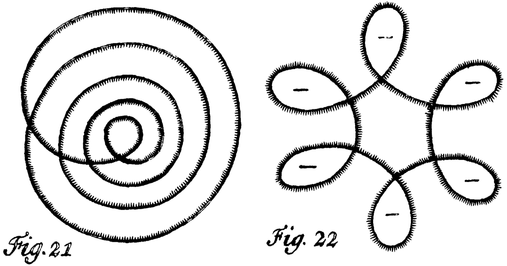

# Curve homotopy and curve invariants$^\alpha$

***Caveat Lector: This note is still pretty sketchy!***

In an earlier lecture we argued that any generic curve in the plane can be continuously deformed into any other by a finite sequence of homotopy moves.  But our earlier argument was unsatisfying for a number of reasons.  First, I deliberately glossed over several details; while I claim that these details are ultimately mechanical, _you_ have no reason to believe my assessment, or even that I've worked out the details at all.  (I _have_ worked out the details, but my mere claim shouldn't be enough to convince you.  Proof by Old Tenured White Dude is not a proof at all.)  Second, the proof is nonconstructive.  Third, the proof gives us no idea _how many_ homotopy moves are required.

## Steinitz's contraction algorithm

The following constructive algorithm for contracting a generic curve via homotopy moves is implicit in Steinitz’s 1916 proof of the seminal theorem that bears his name: A graph $G$ is the 1-skeleton of a three-dimensional convex polyhedron if and only if $G$ is planar and 3-connected.  (I’ll explain the connection between this algorithm and Steinitz’s theorem later in the course.)

We first define some useful substructures of non-simple generic curves.  A _loop_ in a curve $\gamma$ is a simple subpath of $\gamma$ that starts and ends at the same vertex.  A _spindle_ is a pair of simple, interior-disjoint subpaths of $\gamma$ with the same distinct endpoints.   A _vertex_ of a spindle is an endpoint of the subpaths of $\gamma$ that defines it.  A spindle is _convex_ if its interior contains exactly one corner of each vertex.  A spindle is _irreducible_ if its interior does not contain the interior of another bigon; easy case analysis implies that every irreducible spindle is convex.  A _monogon_ is a face whose boundary is a loop; a _bigon_ is a face whose boundary is a (necessarily convex) spindle.

{ width=70% }

**Lemma (Steinitz):**
: _Let $\gamma$ be a non-simple curve with no monogons.  There is at least one irreducible spindle in $\gamma$._

**Proof:**
: Let $x$ be the first vertex encountered twice when traversing $\gamma$ from an arbitrary basepoint; the subpath of $\gamma$ between the two occurrences of $x$ is a loop.  Thus, $\gamma$ contains at least one loop.  Let $\ell$ be the loop with the fewest faces in its interior, breaking ties arbitrarily.

: We call any maximal subpath of $\gamma$ in the interior of $\ell$ a _strand_.  There must be at least one strand, since otherwise $\ell$ would be a monogon.  The minimality of $\ell$ implies that each strand is a _simple_ path.  Each strand in $\ell$ forms a convex spindle with some subpath of $\ell$; thus, $\gamma$ contains at least one spindle.  Any spindle with the fewest faces in its interior is irreducible.

{ width=35% }

**Lemma (Steinitz):**
: _Let $\gamma$ be a non-simple curve with no monogons, and let $\sigma$ be any irreducible spindle in $\gamma$.  Either $\sigma$ is a bigon, or there is a triangular face in the interior of $\sigma$  that shares an edge with $\sigma$._

**Proof:**
: Again, any maximal subpath of $\gamma$ in the interior of $\sigma$ a _strand_; there must be at least one strand, since otherwise $\sigma$ is a bigon.  Irreducibility implies that the strands satisfy three conditions:

: * Every strand is simple.  (Otherwise a strand would contain a loop, and therefore either a monogon or a smaller spindle.) 
: * Every strand has one endpoint on each subpath defining $\sigma$.  (Otherwise, that strand would form a smaller spindle with one side of $\sigma$.)
: * Every pair of strands intersects at most once.  (Otherwise, some pair of strands would define a smaller spindle.)

: Now there are two cases to consider. If no pair of strands intersects, the faces at both vertices are triangles, each sharing _two_ edges with $\sigma$.  Otherwise, imagine continuously sweeping a curve through the interior of $\sigma$ from one boundary subpath to the other, and let $x$ be the first interior vertex that this curve sweeps over.  The two strands that intersect at $x$ form a triangular face with one of the boundary curves of $\sigma$.

With these two lemmas in hand, we can now describe Steinitz’s algorithm.  Let $\gamma$ be any  generic curve with $n$ vertices.  If $n=0$, the curve is simple and there is nothing to do.  If $\gamma$ contains a loop, remove it with a single $1\to0$ move and recursively simplify the remaining curve.  Otherwise, let $\sigma$ be any irreducible spindle.  We empty $\sigma$ by repeatedly performing $3\to3$ moves, each time moving a triangular face from the interior of $\sigma$ to the exterior.  Once $\sigma$ becomes a bigon, we remove it with a single $2 \to 0$ move, and then recursively simplify the remaining curve.

{ width=100% }

In the worst case, the algorithm uses $O(n)$ moves to empty and remove each irreducible spindle.  Each phase of the algorithm removes either one or two vertices.  Thus, the algorithm runs through $\Theta(n)$ phases, each with $O(n)$ moves, so it makes $O(n^2)$ moves altogether.  This analysis is tight; Steinitz’s algorithm requires $\Omega(n^2)$ moves in the worst case.

This is not the fastest contraction algorithm known; in 2016, Hsien-Chih Chang and I described an algorithm to contract any planar curve Hsien using only $O(n^{3/2})$ homotopy moves; we also proved a matching $\Omega(n^{3/2})$ worst-case upper bound.  However, unlike Steinitz’s algorithm, our faster algorithm sometimes uses $0\to2$ moves.  In 2022, Santiago Aranguri, Hsien-Chih Chang, and Dylan Fridman finally proved that any planar curve can be contracted using a sequence of $O(n^{3/2})$ homotopy moves that never increases the number of vertices; the sequence includes only $1\mathord\to 0$, $2\mathord\to 0$, and $3\mathord\to3$ moves.

## Rotation number

Definition: winding number oof the derivative around the origin.  Always an integer.  For simple curves, either $+1$ or $-1$; equal to the winding number around any interior point.

For polygons, equal to sum of exterior angles.  (Studied by Meister in the 1700s, and arguably by Bradwardine in the 1300s.)

Classify points with rightward tangents as _happy_ or _sad_; rotation number = \#happy $-$ \#sad.  [Gauss, possibly Meister]

Gauss: Also equal to sum of rotation numbers of Seifert circles. 

But our usual representation doesn't give us access to tangents or curvature; indeed, generic curves need not have well-defined tangents.  Instead we use a combinatorial formula known to Gauss in terms of the _writhe_ of the curve.  The writhe is defined as the sum over all vertices of the sign of the _first_ crossing at that vertex; we emphasize that writhe is a function of both the curve and the basepoint.
$$
	\textsf{writhe}(\gamma) = \sum_x \textsf{sgn}(x)
$$
To state Gauss's formula succinctly, we also need to extend the definition of winding number to points on the curve.  We define the winding number along an edge of the image graph as the average of the winding numbers of its two incident faces; this is always a half-integer.  Similarly, we define the winding number of a curve around one of its vertices as the average of the winding numbers of the four faces incident to that vertex; this is always an integer.  (Two of those four faces may be the same face.)  We specifically define $\textsf{wind}_0(\gamma)$ to be the winding number of $\gamma$ around its basepoint.

**Lemma (Gauss):**
: $\textsf{rot}(\gamma) = 2 \cdot \textsf{wind}_0(\gamma) + \textsf{writhe}(\gamma)$

**Proof:**
: Moving the basepoint through a positive crossing changes it into a negative crossing (so the writhe decreases by $2$), but it also increases the winding number around the basepoint by $1$.  (So without loss of generality, we could assume that the basepoint is on the outer face and therefore $\textsf{wind}_0(\gamma)= \pm 1/2$, but this won't be necessary.)

: Any continuous deformation of the curve that does not change the number of vertices can only create and destroy happy and sad points in matched pairs.  (Deforming the curve also deforms its derivative, and the deformation of the derivative that avoids the origin can only create or destroy crossings with the positive $x$-axis in matched positive-negative pairs.  Think in terms of homotopy moves!)  So rotation number is an _isotopy_ invariant.

: Now we argue by induction over any sequence of homotopy moves that leads to a simple cycle. We assume the basepoint is far away from whatever move we're analyzing, so $\textsf{wind}_0(\gamma)$ doesn't change.

: * $0\mathord\to 1$: If the deleted vertex is positive, the loop is oriented counterclockwise, so the move decreases both the rotation number and the writhe by $1$.  Similarly, deleting a negative vertex increases both rotation number and writhe by $1$.

: * $2\mathord\to 0$: The two vertices have opposite signs, so the writhe doesn't change.  But the number of happy and sad points doesn't change either, so the rotation number doesn't change.

: * $3\mathord\to 3$: Nothing in the formula changes.

: Finally, we observe that the formula is trivially correct when the curve is simple.

*Would it be easier to argue by induction on the number of vertices via oriented smoothing?  By induction we have $\textsf{rot}(\gamma) = \textsf{rot}(\gamma^-) + \textsf{rot}(\gamma^+) = 2 \cdot \textsf{wind}_0(\gamma^-) + \textsf{writhe}(\gamma^-) + 2 \cdot \textsf{wind}_0(\gamma^+) + \textsf{writhe}(\gamma+)$.  The smoothed vertex vanishes, but it becomes the basepoint of one of the two constituent curves.  The number of crossings between the two constituent curves $\gamma^-$ and $\gamma^+$ is even, with exactly half positive and half negative.  So we need to relate $\textsf{wind}_0(\gamma^+)$ to the sign of the smoothed vertex.*

## Regular homotopy 

No $1\mathord\to 0$ or $0\mathord\to 1$ moves.  So rotation number never changes.

Nowik's algorithm:  Without loss of generality the basepoint is on the outer face.  Repeat the following until the curve consists of empty loops:

* Find a simple loop.
* Empty the loop (two moves per interior vertex, plus one move for each remaining interior strand)
* Move the loop close to the basepoint
* Boy's trick: Cancel two adjacent loops on opposite sides.

When these iterations end, either all loops are inside or all loops are outside.  We can deform one canonical curve to the other using a linear number of moves.  Altogether, the algorithm requires $O(n^2)$ moves to canonize a curve with $n$ vertices.

it follows that rotation number is a complete regular homotopy invariant (just like winding number around a point is a homotopy invariant in the once-punctured plane).

## Strangeness

*(Cite Arnold, Aicardi, Polyak, inter alia)*

$$
	\textsf{strange}(\gamma) = \textsf{wind}_0^2(\gamma) - \frac{1}{4} + \sum_x \textsf{sgn}(x) \cdot \textsf{wind}(\gamma, x)
$$

Basepoint independence: moving the basepoint across a positive vertex $x$ with winding number $w$ changes $x$ to a negative vertex (decreasing the sum by $2w$), but increases $\textsf{wind}_0$ from $w-1/2$ to $w+1/2$ (increasing $\textsf{wind}_0^2(\gamma)$ by $2w$.

**Lemma:**
: _Each $3\to 3$ move changes strangeness by exactly $1$. $2\to0$ moves do not change strangeness._

**Proof:**
: case analysis

Our outer-canonical curves have strangeness $0$, because each vertex has winding number $0$.  So the strangeness of a curve is a lower bound on the number of moves required to canonize it.  A nested counterclockwise loop with rotation number $r$ has $r+1$ positive vertices and strangeness $r(r + 1)/2$.  So Nowik's algorithm is optimal (up to constant factors).

{ width=50% }

## Defect

$$
	\textsf{defect} (\gamma) = -2 \sum_{x\between y} \textsf{sgn}(x) \cdot\textsf{sgn}(y)
$$

**Lemma:**
: _Homotopy moves change defect as follows: $1\to 0$ moves do not change the defect. Each $2\to 0$ move either decreases the defect $2$ or leaves it unchanged.  Each $3\to 3$ move either increases the defect by $2$ or decreases the defect by $2$._

**Proof:**
: Case analysis.

The _flat torus knot_ $T(p,q)$ is defined as
$$
	T(p,q)(\theta) = \big(cos(q\theta)+2)cos(p\theta), (cos(q\theta)+2)sin(p\theta) \big).
$$
This curve has exactly $(p-1)q$ vertices.

{ width=30% }

**Lemma:**
: $\textsf{defect}(T(p,p+1)) = 2\binom{p+1}{3} = n^{3/2}/3 - O(n)$

So indeed, there are $n$-vertex curves that require $\Omega(n^{3/2})$ homotopy moves to simplify, so Hsien-Chih Chang’s and my algorithm is worst-case optimal.

## Aptly Yadda Yadda

* Connection to Steinitz’s theorem via medial graphs
* Connection to electrical reduction via $\Delta Y$-transformations
* Hass and Scott’s lemma for curves on orientable surfaces
* Monotone planar homotopy in $O(n^{3/2})$ moves
* Simplifying curves in the annulus or torus in $O(n^2)$ moves
* $\Omega(n^2)$ lower bound for annular curves via winding depth

